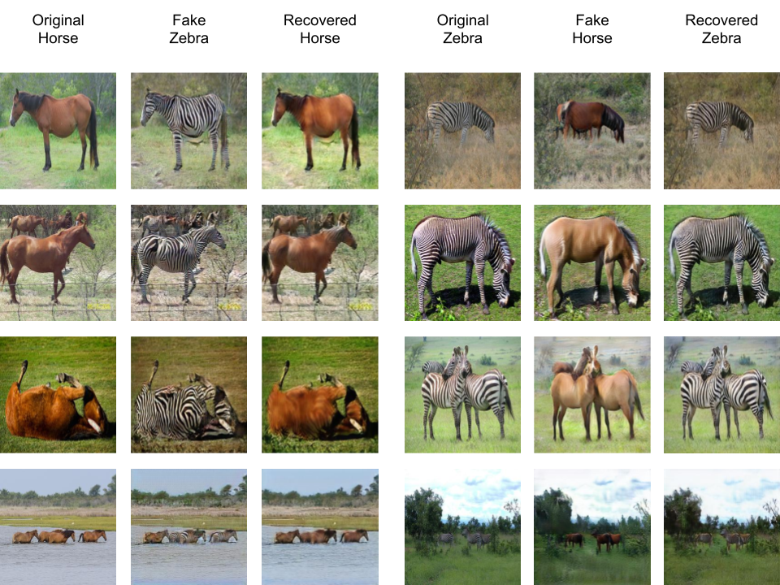

# CycleGAN-JAX

[CycleGAN](https://junyanz.github.io/CycleGAN/) is a deep learning architecture for image-to-image translation that can be trained on unpaired datatsets. We reimplement and train it on several datasets using the [JAX](https://jax.readthedocs.io/en/latest/) framework.

## Curated Outputs



## Installing Dependencies

TODO: script to automatically install dependencies?

```sh
conda create -n cg-jax python=3.9
conda activate cg-jax
```

If CUDA is available (highly recommended for training):

```sh
pip install --upgrade "jax[cuda]" -f https://storage.googleapis.com/jax-releases/jax_cuda_releases.html
```

Otherwise:

```sh
pip install --upgrade "jax[cpu]"
```

Finally:

```sh
pip install flax optax matplotlib jupyter tqdm
pip install torch torchvision # For data loading
```

## Running the Model

To train, prepare a dataset directory with subdirectories `trainA`, `trainB`, `testA`, `testB` populated accordingly, then run

```sh
python main.py --train -d <dataset dir path> -m <model checkpoints and outputs path>
```

To generated an image, run

```sh
python main.py --predict <A|B> -d <file path> -m <model checkpoints and outputs path>
```

where `<A|B>` is the set that the starting image belongs to. 

Hyperparameters and other configuration options are gathered in `train.get_default_opts`.

## Downloading Data

Grant execution permission to `get-*.sh` script, then run. For example,

```sh
chmod +x ./get-horse2zebra.sh
./get-horse2zebra.sh
```

The datasets we use are [hosted](https://people.eecs.berkeley.edu/~taesung_park/CycleGAN/datasets/) by the original CycleGAN authors.